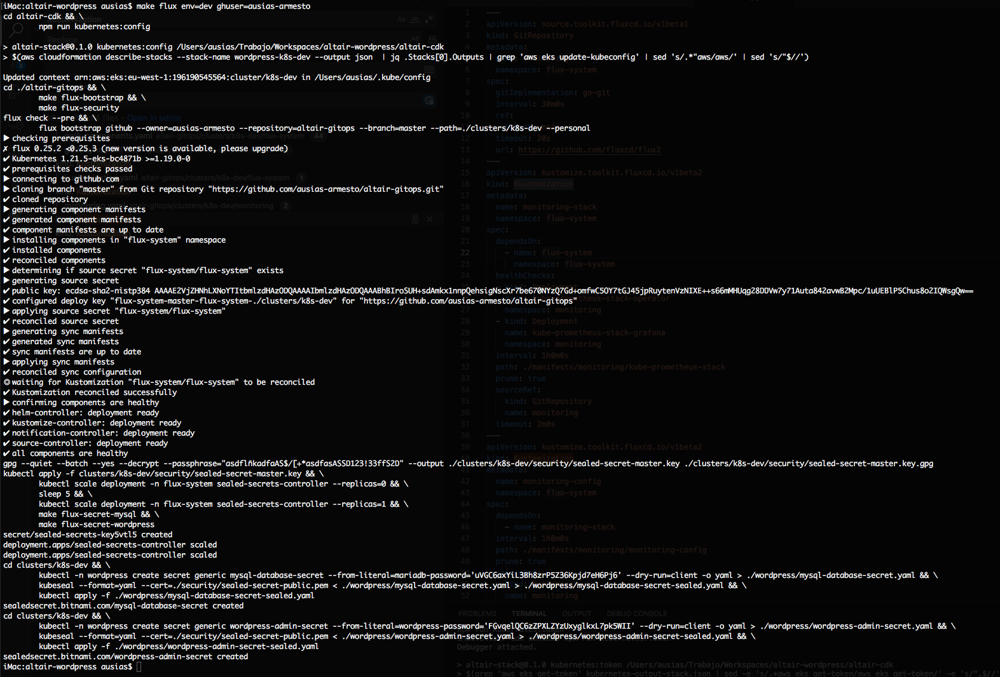
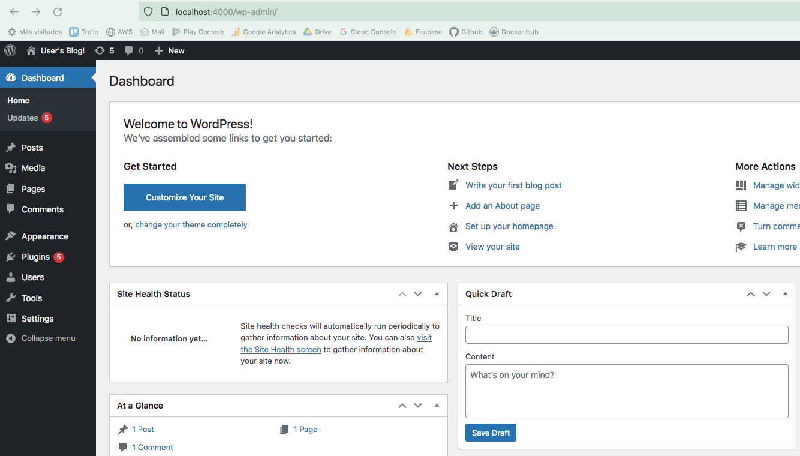
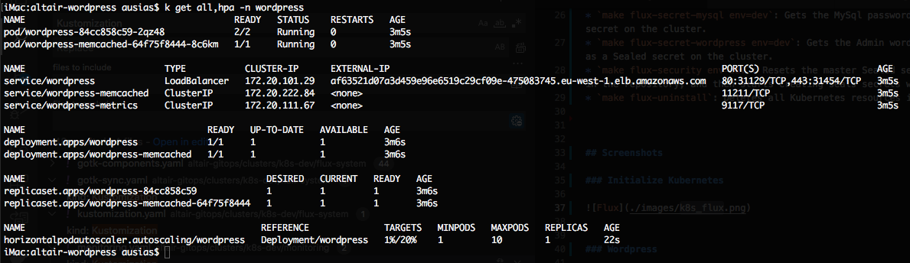
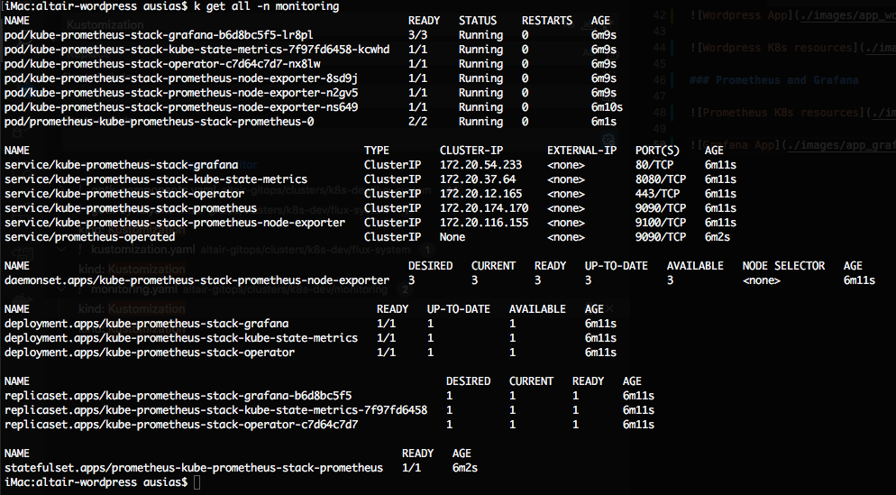
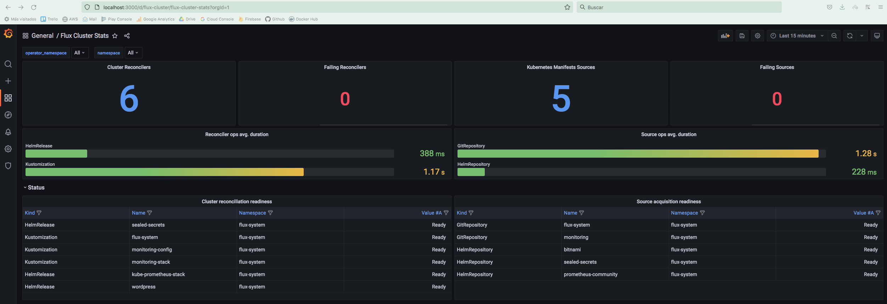

# Git Ops Repository

This repository holds the Kubernetes manifests of the apps to be deployed on Kubernetes. It uses [Flux CD](https://fluxcd.io/) as a continuous delivery tool over Kubernetes.

## Prerequisites

- Installed Kubectl v1.23.1
- Installed Fluxcd 0.25.2
- Installed kubeseal v0.17.2
- Installed yq

## Apps Installed on the Repository

- **Flux CD**: Contains the [Flux CD](https://fluxcd.io/) manifests that governs the cluster
- **Prometheus and Grafana**: On the _monitoring_ folder are stored the manifest to deploy Prometheus and Grafana.
- **Security**: As the Cluster needs to be recreated in case of disaster, in the folder _security_ it is stored the secrets that will be managed by [Sealed Secrets](https://github.com/bitnami-labs/sealed-secrets)
- **Wordpress**: Contains the Helm Release for Wordpress
- **Load Test**: The folder Load Test contains the configuration to add Horizontal Pod Autoscaler feature to the Wordpress Helm Release, and besides starts running a deployment that will inject load into the Wordpress App.


## Commands

* `make create-master-sealed-secret env=dev password=XXXXXXX`: This command is used only once to encrypt the master Sealed Secret and push it to the repository. Once the master sealed secret is uploaded encrypted in the repository you don't need to execute it again.

* Install all the apps on the Kubernetes cluster (FluxCD, Sealed Secrets, Prometheus, Grafana, Wordpress). Change the _ghuser_ with the name of your Github forked repository user.
```
export GITHUB_USER=ausias-armesto
export GITHUB_TOKEN=<my-github-credentials-token>
export EFS_ID=$(aws efs describe-file-systems --query "FileSystems[0].FileSystemId" --output text)
sed -i.back 's/_EFS-ID_/'$EFS_ID'/' ./clusters/k8s-dev/wordpress/wordpress.yaml
git commit -m "Updated the EFS ID" ./clusters/k8s-dev/wordpress/wordpress.yaml
git push
make flux-install env=dev ghuser=ausias-armesto

```
* `make refresh-secrets env=dev`: Takes the encrypted master sealed secret pushed into the repository and applies it into the new cluster. Besides it creates the secrets for Mysql and Wordpress.
* `make flux-security env=dev`: Resets the master Sealed secrets by using the encrypted one stored in the repository, and then starts creating seals secrets with the new master sealed secret. 
* `make flux-uninstall`: Deletes all Kubernetes resources installed on the cluster.


## Screenshots

### Initialize Kubernetes




### Wordpress





### Prometheus and Grafana




